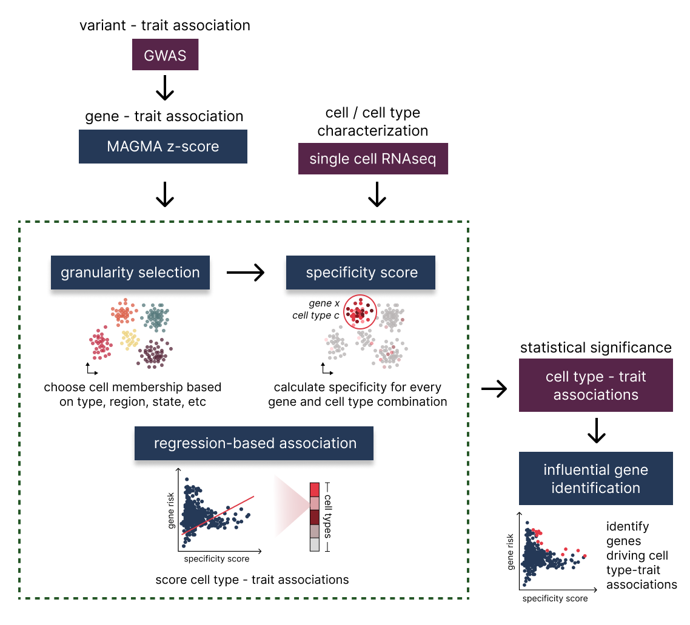

# _seismic_: Single-cell Expression Integration System for Mapping genetically Implicated Cell types
This repository contains code for the R package [_seismicGWAS_](https://github.com/ylaboratory/seismic), an implementation of the 
_seismic_ computational framework for mapping genetically implicated cell types 
and their driver genes in complex traits and diseases,
by integrating GWAS summary statistics and single cell expression data.

## Citation

If you use _seismicGWAS_ we ask that you cite our paper:

> Disentangling associations between complex traits and cell types with _seismic_.
> Lai Q, Dannenfelser R, Roussarie JP, Yao V. BioRxiv. April 2024.

## About

Integrating single-cell RNA sequencing (scRNA-seq) with Genome-Wide Association
Studies (GWAS) can help reveal GWAS-associated cell types furthering our
understanding of the cell-type-specific biological processes underlying complex
traits and disease. In order to rapidly and accurately pinpoint associations, we
develop a novel framework, _seismic_, which characterizes cell types using a new
specificity score. As part of the _seismic_ framework, the specific genes driving
cell type-trait associations can easily be accessed and analyzed, enabling further
biological insights. The following figure depicts a high level overview of
this process. 

<figure>
  
  <figcaption><b>Overview of seismic.</b> <i>seismic</i> allows for a flexible set
  of cell type labels or granularities, ranging from broader cell classes to
  specifically defined cell types, before calculating a novel gene specificity
  score for each of the corresponding cell characterizations, capturing both
  the magnitude and consistency of gene expression. These cell-type-level gene
  specificity scores are then integrated with MAGMA z-scores using a regression
  model to assess the statistical significance of cell type-trait associations,
  under the assumption that disease-critical genes are more specific to the
  implicated cell type.</figcaption>
</figure>

## Installation and dependencies

To install the [seismicGWAS](https://github.com/ylaboratory/seismic) R package first clone the _seismic_ repo and then 
use devtools within R to point to _seismic_ and install. The R environment version
should be 4.0.0 or higher. 

First download the repository to your local machine, and then directly install it in R:

```R
devtools::install(path_to_seismic_folder)
library('seismicGWAS')
```

Or alternatively, you can install the package directly from GitHub using the following command:

```R
devtools::install_github("ylaboratory/seismicGWAS")
library('seismicGWAS')
```

The package requires several dependencies which are listed in the `DESCRIPTION` file,
which will be installed automatically.

## Usage

Below we quickly show how to use _seismicGWAS_ to calcuate cell
type-trait associations for the sample data included in the package. 

```R
# calculate cell type specificity scores using included sample data
# estimated running time: less than 1 minute
tmfacs_sscore <- calc_specificity(tmfacs_sce_small, ct_label_col='cluster_name')

# convert mouse gene identifiers to human ones that match data in GWAS summary data
# from MAGMA
# estimated running time: 3 seconds
tmfacs_sscore_hsa <- translate_gene_ids(tmfacs_sscore, from='mmu_symbol')

# calculate cell type-trait associations for type 2 diabetes
# estimated running time: less than 1 minutes
get_ct_trait_associations(tmfacs_sscore_hsa, t2d_magma)

# find the influential genes for a significant cell type-trait association
# in type 2 diabetes
# estimated running time: 10 seconds
find_inf_genes("Pancreas.beta cell", tmfacs_sscore_hsa, t2d_magma)
```

For full usage details, including a walk through of all major functions and 
the extra upstream data preprocessing instructions, please check out
our more extensive tutorial:

- [Introduction and walk through](https://ylaboratory.github.io/seismicGWAS-page/articles/seismicGWAS.html)
- [GWAS preprocessing](https://ylaboratory.github.io/seismicGWAS-page/articles/GWAS_processing.html)
- [scRNA-seq preprocessing](https://ylaboratory.github.io/seismicGWAS-page/articles/scRNA-seq_processing.html)
