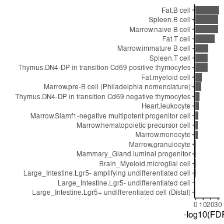
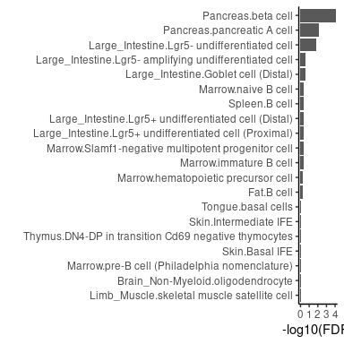
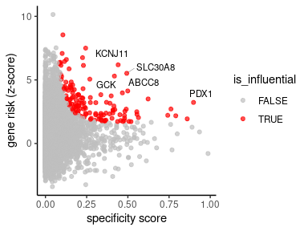
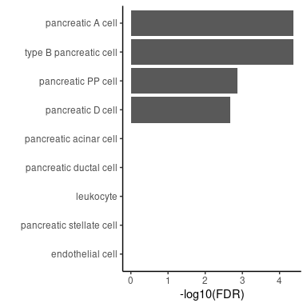

A simple introduction to seismic
================

This vignette introduces the `seismicGWAS` package an implementation of
the *seismic* framework for linking cell types with traits using
single-cell RNA-seq data and MAGMA summarized GWAS data. We organize
this vignette in two sections: Section 1 contains a walk through using
the sample data included with the `seismicGWAS` package, and Section 2
walks through data starting from a SingleCellExperiment object. In both
cases, [MAGMA](https://cncr.nl/research/magma/) is needed to produce
gene level GWAS summaries.

## Setup

First, install and load the seismic package. If you have not yet
installed `seismicGWAS`, use
`devtools::install(path_to_seismic_folder)`.

``` r
library(seismicGWAS)
```

# Section 1: running *seismic* on the included sample data

*seismicGWAS* includes a preloaded small single cell RNAseq dataset in
the form of a SingleCellExperiment object `tmfacs_sce_small`

``` r
tmfacs_sce_small
#> class: SingleCellExperiment 
#> dim: 23341 4000 
#> metadata(0):
#> assays(1): logcounts
#> rownames(23341): 0610005C13Rik 0610007C21Rik ... l7Rn6
#>   zsGreen-transgene
#> rowData names(1): symbol
#> colnames(4000): M4.MAA000844.3_10_M.1.1 A18.MAA000388.3_11_M.1.1 ...
#>   M5.MAA000910.3_10_M.1.1 L2.MAA000563.3_10_M.1.1
#> colData names(17): nReads orig.ident ... sizeFactor cluster_name
#> reducedDimNames(0):
#> mainExpName: RNA
#> altExpNames(0):
```

and two sample MAGMA files, one for Rheumatoid Arthritis ([Okada et
al. 2013](https://doi.org/10.1038/nature12873))

``` r
head(ra_magma)
#>     GENE CHR  START   STOP NSNPS NPARAM     N     ZSTAT       P
#> 1 148398   1 824993 889961     1      1 58284 -0.025069 0.51000
#> 2 339451   1 860967 911099     1      1 58284 -0.025069 0.51000
#> 3  84069   1 866872 920488    12      2 58284 -0.671780 0.74914
#> 4  26155   1 869583 929679    36      4 58284 -1.717100 0.95702
#> 5  84808   1 900579 952473    80      6 58284 -1.124900 0.86968
#> 6   9636   1 913847 959920    93      7 58284 -0.991290 0.83923
```

and one for Type 2 Diabetes ([Xue et
al. 2018](https://doi.org/10.1038/s41467-018-04951-w%5D))

``` r
head(t2d_magma)
#>     GENE CHR   START    STOP NSNPS NPARAM      N    ZSTAT        P
#> 1 254173   1 1074286 1143315    21      3 572082  1.75840 0.039337
#> 2   8784   1 1128888 1177163     6      1 572870  1.93210 0.026671
#> 3  55210   1 1412523 1480067     9      1 569925  0.24436 0.403470
#> 4 339453   1 1460158 1510740    37      2 571069  0.14879 0.440860
#> 5  29101   1 1467053 1545262    39      2 571016  0.15608 0.437990
#> 6   9906   1 1646277 1712438    16      2 576212 -0.48124 0.684830
```

## Calculating cell type specificity scores

The first step of *seismic* is to calculate cell type specificity scores
which will be used for subsequent cell type-trait association
calculations and influential gene analyses. Here we provide the sample
SingleCellExperiment object and column in the data containing cell type
labels `cluster_name`.

``` r
tmfacs_sscore <- calc_specificity(tmfacs_sce_small, ct_label_col='cluster_name')
head(tmfacs_sscore[, 1:3]) # show a truncated view of the matrix
#>               Bladder.Bladder mesenchymal cell
#> 0610005C13Rik                       0.00000000
#> 0610007C21Rik                       0.05171198
#> 0610007L01Rik                       0.05053099
#> 0610007N19Rik                       0.10618537
#> 0610007P08Rik                       0.04881961
#> 0610007P14Rik                       0.04976406
#>               Bladder.Luminal bladder epithelial cell
#> 0610005C13Rik                            0.000000e+00
#> 0610007C21Rik                            5.416472e-02
#> 0610007L01Rik                            5.907819e-02
#> 0610007N19Rik                            4.726793e-05
#> 0610007P08Rik                            6.890189e-02
#> 0610007P14Rik                            6.196749e-02
#>               Brain_Myeloid.microglial cell
#> 0610005C13Rik                  3.639054e-19
#> 0610007C21Rik                  3.768650e-02
#> 0610007L01Rik                  3.409995e-07
#> 0610007N19Rik                 4.422689e-185
#> 0610007P08Rik                  2.758088e-08
#> 0610007P14Rik                  2.225707e-17
```

The original single cell experiment in the `tmfacs_sce_small` was
derived from Tabula Muris. To associate with human GWAS traits we need
to convert the gene identifiers. For convenience *seismicGWAS* has a
function for translating between gene ids for a specificity score
matrix. We change here from mouse gene symbols to human entrez ids to
match the MAGMA data.

``` r
tmfacs_sscore_hsa <- translate_gene_ids(tmfacs_sscore, from='mmu_symbol')
head(tmfacs_sscore_hsa[,1:3]) # show a truncated view of the matrix
#> 6 x 3 Matrix of class "dgeMatrix"
#>        Bladder.Bladder mesenchymal cell Bladder.Luminal bladder epithelial cell
#> 81932                      2.542912e-04                              0.01671191
#> 81577                      5.003187e-04                              0.01487892
#> 8614                       9.234388e-02                              0.02736780
#> 256281                     3.213228e-07                              0.08150739
#> 221687                     0.000000e+00                              0.00000000
#> 346389                     0.000000e+00                              0.17272120
#>        Brain_Myeloid.microglial cell
#> 81932                   7.503793e-12
#> 81577                   3.645070e-10
#> 8614                    0.000000e+00
#> 256281                  7.970981e-07
#> 221687                  0.000000e+00
#> 346389                  0.000000e+00
```

## Calculating cell type trait associations

We can now get cell type-trait associations for the RA and Type 2
Diabetes data and plot the top 20 associations per trait. Default plots
show FDR corrected p-values plotted on a -log scale so that stronger
associations appear at the top of the boxplot.

``` r
# calculate and plot the cell type-trait associations for RA
ra <- get_ct_trait_associations(tmfacs_sscore_hsa, ra_magma)
plot_top_associations(ra, limit = 20)
```

<!-- -->

``` r
# calculate and plot the cell type-trait associations for T2D
t2d <- get_ct_trait_associations(tmfacs_sscore_hsa, t2d_magma)
plot_top_associations(t2d, limit = 20)
```

<!-- -->

## Influential gene analysis

With *seismicGWAS* we can also look at the genes driving a particular
cell type-trait association, in a process we call influential gene
analysis. Here, we need to select a particular cell type (in our example
we choose pancreas beta cell) and a trait (we use Type 2 Diabetes
again). It is important to note that influential gene calculations are
only meaningful for cell type-trait associations that are significant.
So we have chosen a cell type and trait that were found to be
significant in the cell type-trait associations above.

``` r
# calculate influential genes
ct <- "Pancreas.beta cell"
t2d_beta_inf_genes <- find_inf_genes(ct, tmfacs_sscore_hsa, t2d_magma)
head(t2d_beta_inf_genes)
#>      gene specificity  zstat   dfbetas is_influential
#>    <char>       <num>  <num>     <num>         <lgcl>
#> 1:   3767   0.4410499 6.1866 0.1941221           TRUE
#> 2: 169026   0.4932408 5.5197 0.1886886           TRUE
#> 3:   2645   0.4184336 5.2990 0.1513507           TRUE
#> 4:   3651   0.8982126 3.2276 0.1386102           TRUE
#> 5:   6833   0.4991599 4.1322 0.1293991           TRUE
#> 6:   7466   0.2439394 7.5000 0.1256267           TRUE
```

Note: Only genes with positive contributions to the cell type-trait
association are marked influential by default. While negative
contributions may be informative, they are not as directly interpretable
and are driven by genes from other cell types or are somewhat cell type
specific but not associated with the given trait.

Next, to aid in result interpretation we make use of the `biomaRt`
package to convert entrez ids to gene symbols.

``` r
# convert ids to symbols using biomaRt
library(biomaRt)

ensembl <- useMart("ensembl", dataset = "hsapiens_gene_ensembl")
hsa.map <- getBM(attributes = c('entrezgene_id', 'hgnc_symbol'), 
                 filters = 'entrezgene_id', 
                 values = t2d_beta_inf_genes$gene, 
                 mart = ensembl)

hsa.map$entrezgene_id <- as.character(hsa.map$entrezgene_id)
t2d_beta_inf_genes <- merge(t2d_beta_inf_genes, hsa.map, 
                            by.x='gene', by.y='entrezgene_id')
```

We can also use the gene symbols to label the influential points in the
influential gene plot.

``` r
# plot influential genes
plot_inf_genes(t2d_beta_inf_genes, gene_col = 'hgnc_symbol', num_labels = 5)
```

<!-- -->

# Section 2: running *seismicGWAS* on Tabula Muris Senis

Generally, we assume that users will be able to construct and
appropriately normalize their single cell data before using
`seismicGWAS`. For these tasks we recommend using the `scran` package.

In this section we illustrate how to run the *seismicGWAS* package on a
real world single cell dataset from Tabula Muris. For convenience we use
the [`scFind`](https://github.com/hemberg-lab/scfind) package to grab
tissue level SingleCellExperiment objects.

## Grabbing Tabula Muris pancreas data with scFind

For simplicity, we grab one tissue type’s worth of data from the
`scfind` package.

``` r
# if scFind is not installed can install with devtools
# devtools::install_github("hemberg-lab/scfind")
library(scfind)
sce_panc <- readRDS(url(tmfacs["Pancreas"]))
```

Explore the SCE object to find the relevant cell type column. If one did
not exist, or one did not exist with our desired specificity, we could
create it by clustering, combining, or using other metadata and adding
to the SCE object before continuing.

``` r
colData(sce_panc)
#> DataFrame with 1961 rows and 7 columns
#>                             mouse     well             cell_type1   tissue
#>                          <factor> <factor>               <factor> <factor>
#> B21.MAA000574.3_8_M.1.1     3_8_M      B21              NA        Pancreas
#> D12.MAA000574.3_8_M.1.1     3_8_M      D12              NA        Pancreas
#> B22.MAA000574.3_8_M.1.1     3_8_M      B22              NA        Pancreas
#> D13.MAA000574.3_8_M.1.1     3_8_M      D13              leukocyte Pancreas
#> C1.MAA000574.3_8_M.1.1      3_8_M      C1               NA        Pancreas
#> ...                           ...      ...                    ...      ...
#> I9.MAA001868.3_38_F.1.1    3_38_F      I9  pancreatic acinar cell Pancreas
#> K10.MAA001868.3_38_F.1.1   3_38_F      K10 NA                     Pancreas
#> M19.MAA001868.3_38_F.1.1   3_38_F      M19 pancreatic acinar cell Pancreas
#> O9.MAA001868.3_38_F.1.1    3_38_F      O9  NA                     Pancreas
#> P16.MAA001868.3_38_F.1.1   3_38_F      P16 NA                     Pancreas
#>                          subtissue     FACS      sex
#>                           <factor> <factor> <factor>
#> B21.MAA000574.3_8_M.1.1   Exocrine   Viable        M
#> D12.MAA000574.3_8_M.1.1   Exocrine   Viable        M
#> B22.MAA000574.3_8_M.1.1   Exocrine   Viable        M
#> D13.MAA000574.3_8_M.1.1   Exocrine   Viable        M
#> C1.MAA000574.3_8_M.1.1    Exocrine   Viable        M
#> ...                            ...      ...      ...
#> I9.MAA001868.3_38_F.1.1   Exocrine   Viable        F
#> K10.MAA001868.3_38_F.1.1  Exocrine   Viable        F
#> M19.MAA001868.3_38_F.1.1  Exocrine   Viable        F
#> O9.MAA001868.3_38_F.1.1   Exocrine   Viable        F
#> P16.MAA001868.3_38_F.1.1  Exocrine   Viable        F
```

The `cell_type1` field contains the cell annotations that we can use for
calculating cell specificity scores. Right now there are some `NA`
values for field. Lets remove them before continuing.

``` r
# remove cells with NA from the SCE object
sce_panc_filt <- sce_panc[,!is.na(colData(sce_panc)$cell_type1)]
colData(sce_panc_filt)
#> DataFrame with 1327 rows and 8 columns
#>                             mouse     well             cell_type1   tissue
#>                          <factor> <factor>               <factor> <factor>
#> D13.MAA000574.3_8_M.1.1     3_8_M      D13 leukocyte              Pancreas
#> D14.MAA000574.3_8_M.1.1     3_8_M      D14 pancreatic acinar cell Pancreas
#> C5.MAA000574.3_8_M.1.1      3_8_M      C5  pancreatic acinar cell Pancreas
#> A3.MAA000574.3_8_M.1.1      3_8_M      A3  pancreatic PP cell     Pancreas
#> C11.MAA000574.3_8_M.1.1     3_8_M      C11 pancreatic acinar cell Pancreas
#> ...                           ...      ...                    ...      ...
#> M16.MAA001868.3_38_F.1.1   3_38_F      M16 pancreatic acinar cell Pancreas
#> M17.MAA001868.3_38_F.1.1   3_38_F      M17 pancreatic acinar cell Pancreas
#> P15.MAA001868.3_38_F.1.1   3_38_F      P15 pancreatic acinar cell Pancreas
#> I9.MAA001868.3_38_F.1.1    3_38_F      I9  pancreatic acinar cell Pancreas
#> M19.MAA001868.3_38_F.1.1   3_38_F      M19 pancreatic acinar cell Pancreas
#>                          subtissue     FACS      sex sizeFactor
#>                           <factor> <factor> <factor>  <numeric>
#> D13.MAA000574.3_8_M.1.1   Exocrine   Viable        M  1.9765270
#> D14.MAA000574.3_8_M.1.1   Exocrine   Viable        M  1.2732105
#> C5.MAA000574.3_8_M.1.1    Exocrine   Viable        M  0.7804386
#> A3.MAA000574.3_8_M.1.1    Exocrine   Viable        M  0.0969612
#> C11.MAA000574.3_8_M.1.1   Exocrine   Viable        M  1.4387834
#> ...                            ...      ...      ...        ...
#> M16.MAA001868.3_38_F.1.1  Exocrine   Viable        F  0.1675565
#> M17.MAA001868.3_38_F.1.1  Exocrine   Viable        F  0.0712616
#> P15.MAA001868.3_38_F.1.1  Exocrine   Viable        F  0.1585532
#> I9.MAA001868.3_38_F.1.1   Exocrine   Viable        F  0.2143557
#> M19.MAA001868.3_38_F.1.1  Exocrine   Viable        F  0.2392390
```

## Calculating cell type-trait associations

Now we can calculate the cell type specificity scores we will need for
other downstream functions.

``` r
# calculate cell specificity
panc_sscore <- calc_specificity(sce_panc_filt, ct_label_col='cell_type1')
head(panc_sscore[,1:4]) # show a truncated view of the matrix
#>               endothelial cell    leukocyte pancreatic A cell
#> 0610007C21Rik     1.925564e-02 8.198702e-08      1.996716e-01
#> 0610007L01Rik     2.031098e-03 8.280322e-06      1.576197e-01
#> 0610007N19Rik     4.378839e-13 0.000000e+00      5.664380e-19
#> 0610007P08Rik     3.511300e-13 2.826381e-05      1.804820e-01
#> 0610007P14Rik     1.026578e-03 6.615702e-06      1.918313e-01
#> 0610007P22Rik     1.052606e-04 8.502420e-03      1.250415e-01
#>               pancreatic acinar cell
#> 0610007C21Rik          8.149700e-216
#> 0610007L01Rik           3.567238e-43
#> 0610007N19Rik           6.355130e-02
#> 0610007P08Rik           3.894345e-12
#> 0610007P14Rik          5.294229e-107
#> 0610007P22Rik           7.515759e-21
```

Since we are using a subset of Tabula Muris it is time again to convert
mouse gene symbols to human entrez ids before continuing so that we can
match the identifiers in the human Type 2 Diabetes GWAS data.

``` r
panc_sscore_hsa <- translate_gene_ids(panc_sscore, from='mmu_symbol')
head(panc_sscore_hsa[,1:4]) # show a truncated view of the matrix
#> 6 x 4 Matrix of class "dgeMatrix"
#>        endothelial cell    leukocyte pancreatic A cell pancreatic acinar cell
#> 81932       0.004922072 0.000000e+00      2.088431e-01           6.213640e-04
#> 81577       0.119625749 1.955628e-16      1.127160e-01           3.838398e-31
#> 8614        0.000000000 0.000000e+00      2.420464e-05           1.766824e-01
#> 256281      0.004280693 9.500268e-03      1.938377e-01           8.279519e-95
#> 221687      0.000000000 0.000000e+00      1.659393e-37           0.000000e+00
#> 346389      0.000000000 0.000000e+00      1.067150e-07           1.468089e-05
```

Finally, we can calculate cell type-trait associations as before.

``` r
panc_t2d <- get_ct_trait_associations(panc_sscore_hsa, t2d_magma)
plot_top_associations(panc_t2d, limit = 20)
```

<!-- -->
